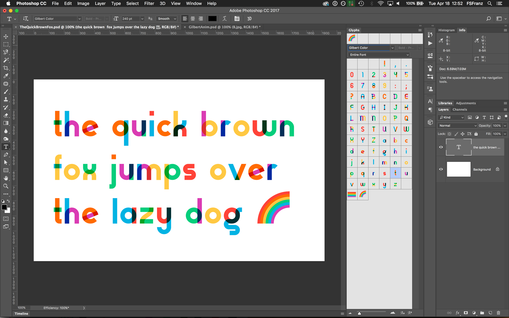

# Gilbert usage guide

This document demonstrates how to use the Gilbert fonts.

*Gilbert* can be installed and used in many apps and operating systems, like any other standard OpenType font file.

*Gilbert Color* can also be installed on both Mac & PC but it will be displayed only in a few apps since it relies on a new color font format, [OpenType-SVG](https://www.microsoft.com/typography/otspec/svg.htm). Color fonts are currently supported by [a couple browsers](http://stateofwebtype.com/#OpenType-SVG) (Firefox and Microsoft Edge) and [more recently](https://blogs.adobe.com/creativecloud/photoshop-cc-adds-support-for-opentype%E2%88%92svg-fonts-an-in-depth-look/) at least by one creative app (Photoshop CC 2017).

The good news is you can actually provide fallback versions of a font within the same font file, so a color font may include the standard "black" font to ensure anyone can see the actual shape of the typeface, whatever color font support they have. 

The bad news is that Gilbert Color does NOT YET include such fallback solution, so when you install Gilbert Color on your computer, it will simply show up blank :( 

Don't panic, if you see an empty font in your Font Book or Font Manager, the color font data is still around. You will just have to load Photoshop CC 2017 to actually see the font:

You can try it by yourself by loading the sample Photoshop PSD file, TheQuickBrownFox.psd (remember, Photoshop CC 2017 is required)

FYI, many other software, browser and operating system makers are interested to support color fonts, so you can expect to be able to use Gilbert Color in many more apps soon ;) 

- Visit Adobe's help page to learn more about Photoshop's support: https://helpx.adobe.com/typekit/using/ot-svg-color-fonts.html
- Check Fontself’s dedicated resource to learn more about color fonts: www.colorfonts.wtf 
- And read this great article on the evolution of chromatic type: http://ilovetypography.com/2017/04/03/the-evolution-of-chromatic-fonts
